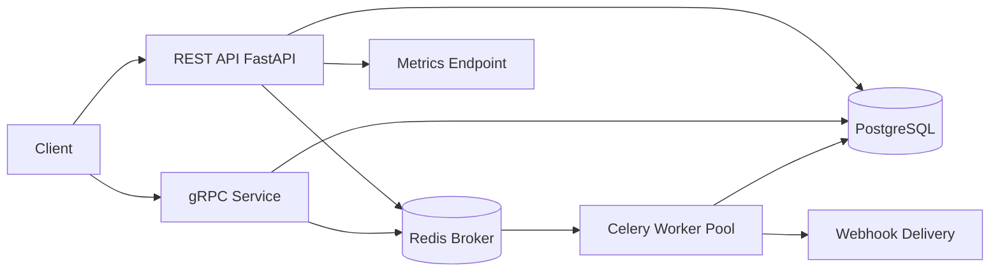

# FlowForge

FlowForge is a production-style async job processing platform that exposes both REST and gRPC interfaces over a shared worker queue. It demonstrates end-to-end backend ownership: API design, state transitions, retries with exponential backoff, queue workers, persistence, Docker Compose local orchestration, and Kubernetes deployment manifests.

## Architecture



## Tech Stack

| Layer | Tools |
| --- | --- |
| API | FastAPI, gRPC (`grpcio`) |
| Queue | Celery + Redis |
| Database | PostgreSQL + SQLAlchemy |
| Runtime | Python 3.12 |
| Testing | pytest |
| Local Infra | Docker Compose |
| Deployment | Kubernetes YAML manifests |

## Project Structure

```text
flowforge/
├── api/
│   ├── rest/main.py              # REST endpoints
│   └── grpc/
│       ├── server.py             # gRPC server implementation
│       └── generated/            # generated protobuf files
├── worker/
│   ├── tasks.py                  # queue execution + retries
│   ├── executor.py               # business execution logic
│   └── webhook.py                # completion webhook sender
├── db/
│   ├── models.py                 # SQLAlchemy models
│   ├── service.py                # state transitions and CRUD
│   └── state_machine.py          # transition guards
├── proto/flowforge.proto         # gRPC contract
├── infra/
│   ├── docker-compose.yml
│   └── k8s/
├── tests/unit/
└── dashboard/index.html
```

## Quickstart (Docker Compose)

```bash
cd flowforge
docker compose -f infra/docker-compose.yml up --build
```

REST API: `http://localhost:8000`
gRPC: `localhost:50051`

## REST API Reference

### Submit Job

```http
POST /jobs
Content-Type: application/json

{
  "payload": {
    "operation": "sum_numbers",
    "numbers": [10, 15, 5]
  },
  "priority": 1,
  "webhook_url": "https://example.com/webhook"
}
```

Response (`202 Accepted`):

```json
{
  "id": "f00f12fd-d673-4c95-8f8b-5f6129956f77",
  "status": "pending"
}
```

### Fetch Job Status

```http
GET /jobs/{job_id}
```

### List Jobs

```http
GET /jobs?status=running&limit=20&offset=0
```

### Cancel Job

```http
DELETE /jobs/{job_id}
```

### Metrics

```http
GET /metrics
```

## gRPC API

Service: `flowforge.FlowForge`

Methods:
- `SubmitJob(SubmitJobRequest) -> JobResponse`
- `GetJobStatus(GetJobStatusRequest) -> JobStatusResponse`
- `StreamJobUpdates(GetJobStatusRequest) -> stream JobStatusResponse`

Generate stubs:

```bash
cd flowforge
../.venv/bin/python -m grpc_tools.protoc \
  -I ./proto \
  --python_out=./api/grpc/generated \
  --grpc_python_out=./api/grpc/generated \
  ./proto/flowforge.proto
```

## Job State Machine

```text
pending -> running -> completed
                \-> retrying -> running
                \-> failed
pending -> canceled
running -> canceled
retrying -> canceled
```

## Retry Strategy

Transient failures trigger retries with exponential backoff:

- Attempt 1: `base * 2^0`
- Attempt 2: `base * 2^1`
- Attempt 3: `base * 2^2`

Configured by:
- `FLOWFORGE_MAX_JOB_RETRIES`
- `FLOWFORGE_BASE_BACKOFF_SECONDS`

## Testing

```bash
cd flowforge
../.venv/bin/python -m pytest
```

Current suite covers:
- State-machine transition rules
- Backoff behavior
- Worker payload execution logic

## Kubernetes Deployment

Apply in order:

```bash
kubectl apply -f infra/k8s/namespace.yaml
kubectl apply -f infra/k8s/configmap.yaml
kubectl apply -f infra/k8s/postgres.yaml
kubectl apply -f infra/k8s/redis.yaml
kubectl apply -f infra/k8s/api.yaml
kubectl apply -f infra/k8s/grpc.yaml
kubectl apply -f infra/k8s/worker.yaml
```

Note: `infra/k8s/*.yaml` references placeholder container images (`ghcr.io/your-org/...`). Update them to your actual image tags before deploying.

## Design Decisions

- **REST + gRPC side-by-side**: REST serves broad compatibility; gRPC supports efficient service-to-service calls and streaming.
- **Celery over custom queue**: Built-in retries, operational maturity, and cleaner worker semantics.
- **Explicit state-machine guardrails**: Transition validation prevents invalid status updates under failure conditions.
- **Database as source of truth**: Worker state and outcomes remain queryable regardless of broker restarts.

## Demo Script

1. Start stack with Docker Compose.
2. Submit 10 jobs via `POST /jobs`.
3. Query `/metrics` to observe queue movement.
4. Submit a job with `{"force_transient_failure": true}` and watch retries.
5. Stream a job via gRPC `StreamJobUpdates`.

## What To Build Next

- Add Prometheus metrics endpoint and Grafana dashboards.
- Add integration tests with ephemeral Redis/Postgres containers.
- Add client-level rate limiting and priority queue routing.
